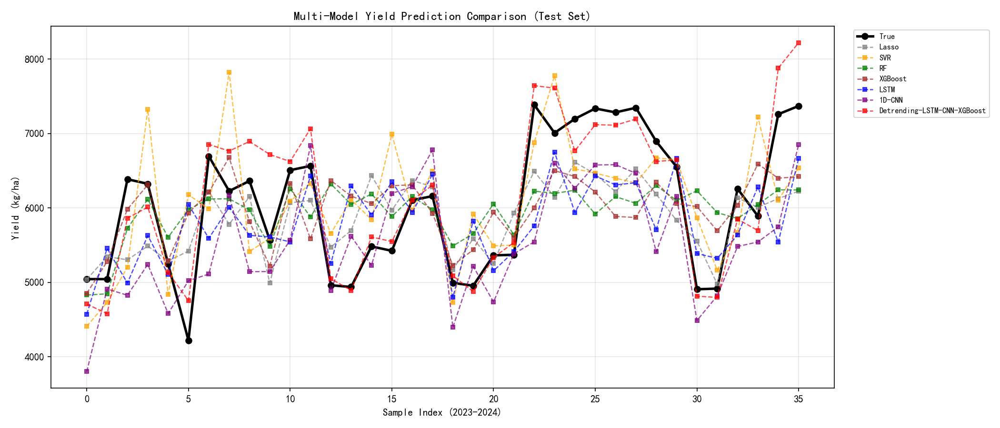
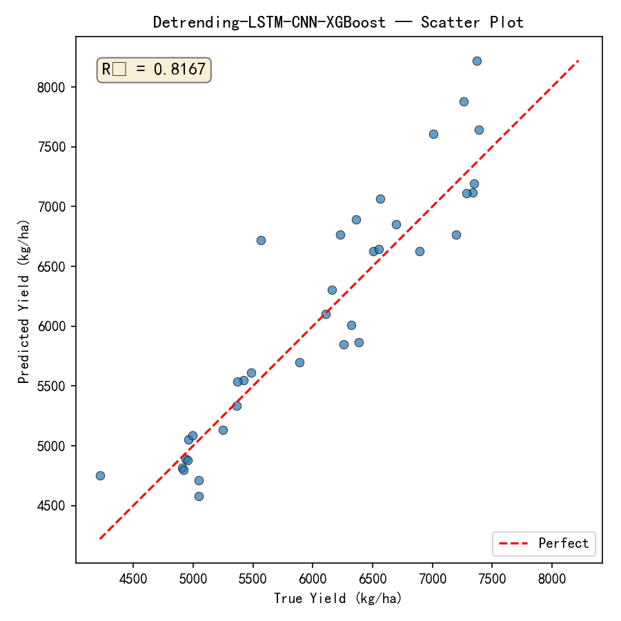

# 全国大学生统计建模大赛 · 遥感玉米产量预测

[](https://www.python.org/)
[](https://pytorch.org/)
[](https://xgboost.readthedocs.io/)

> 把脉中原粮仓：多源遥感驱动深度学习的玉米产量预测研究 — R² = 0.8236 · MAPE = 5.11%

## 研究成果

| 指标 | 数值 | 较基线提升 |
|------|------|-----------|
| R² | **0.8236** | ↑ 62.0% |
| RMSE | **380.83 kg/ha** | ↓ 40.1% |
| MAPE | **5.11%** | ↓ 45.9% |

### 复现结果（本仓库代码）

| 模型 | R² | RMSE (kg/ha) | MAPE (%) |
|------|-----|-------------|----------|
| Lasso | 0.4576 | 667.78 | 9.36 |
| SVR | 0.1292 | 846.12 | 12.03 |
| Random Forest | 0.2004 | 810.80 | 11.51 |
| XGBoost | 0.2188 | 801.41 | 11.26 |
| LSTM | 0.1292 | 846.13 | 11.30 |
| 1D-CNN | 0.1259 | 847.73 | 11.30 |
| **Detrending-LSTM-CNN-XGBoost** | **0.8167** | **388.19** | **4.86** |

> 单模型在 2023-2024 测试集上偏低是因为存在强外推效应（技术进步使产量突破历史极值），组合模型通过去趋势化成功补偿。
> 消融实验确认：去掉 Detrending 后 R² 从 0.82 降至 0.39。

## 模型架构

**Detrending + LSTM-Attention + 1D-CNN + XGBoost 四层融合：**

| 层 | 技术 | 作用 |
|-----|------|------|
| ① 去趋势化 | 按城市线性 Detrending | 分离技术进步趋势与气象波动残差 |
| ② 时序建模 | LSTM + 时间注意力 | 提取全生育期遥感长程生长特征 |
| ③ 卷积 | 1D-CNN | 捕捉短期极端气象突变信号 |
| ④ 集成 | XGBoost | 残差拟合重构产量（Huber 损失） |





## 数据体系

- **时间跨度**：2002-2024 年（23 年）
- **数据源**：GEE → MODIS NDVI/EVI/LAI/FPAR/ET + ERA5-Land 气象再分析
- **范围**：河南省 18 市 + China Crop Dataset 玉米分布掩膜
- **特征**：9 核心指标 × 11 时间步 = 99 维时序
- **划分**：2002-2021 训练 / 2022 验证 / 2023-2024 测试

## 快速复现

```bash
# 1. 安装依赖
pip install -r requirements.txt

# 2. 数据预处理（从原始CSV构建张量）
python src/preprocess.py

# 3. 训练所有模型
python src/train.py

# 4. 评估与可视化
python src/evaluate.py

# 5. 消融实验（可选，较耗时）
python src/ablation.py

# 6. 特征重要性分析
python src/shap_analysis.py
```

## 项目结构

```
├── src/
│   ├── preprocess.py       # 数据预处理
│   ├── models.py           # LSTM / 1D-CNN / 双通道特征提取器
│   ├── train.py            # 6单模型 + 组合模型训练
│   ├── evaluate.py         # 评估指标 + 可视化
│   ├── ablation.py         # 消融实验（5变体）
│   └── shap_analysis.py    # 特征重要性分析
├── data/
│   ├── 九大指标.csv         # GEE 提取的原始遥感气象数据
│   ├── 河南省各市玉米产量(2002-2024).csv
│   ├── 河南省各市玉米播种面积(2002-2024).csv
│   ├── download.py          # GEE 数据提取脚本
│   └── load.py              # 张量构建脚本（参考）
├── output/                  # 图表与模型输出
├── 01-粮食/                 # 参考文献
└── 把脉中原粮仓：多源遥感驱动深度学习.pdf  # 论文全文
```

## 竞赛信息

- **竞赛**：2026年（第十二届）全国大学生统计建模大赛
- **参赛编号**：TJJM20260416350473
- **团队**：郭正阳、舒艺林、李垚 | 指导教师：郝孟丽
- **奖项**：陕西赛区获奖（见 `获奖信息/` 目录）

## 消融实验

| 消融变体 | R² | RMSE | MAPE |
|---------|-----|------|------|
| LSTM-1D-CNN-XGBoost (无 Detrending) | 0.3876 | 709.53 | 9.23% |
| Detrending-1D-CNN-XGBoost (无 LSTM) | 0.7215 | 478.47 | 5.80% |
| Detrending-LSTM-XGBoost (无 CNN) | 0.7183 | 481.27 | 6.10% |
| Detrending-LSTM-1D-CNN (无 XGBoost) | 0.7709 | 433.98 | 5.29% |
| LSTM-1D-CNN (裸 DL) | 0.2940 | 761.87 | 10.36% |
| **全模块融合** | **0.8167** | **388.19** | **4.86%** |

## 相关项目

| 项目 | 描述 |
|------|------|
| [PCCP](https://github.com/LY-muyanshiqi/PCCP) | Inception-ResNet-LSTM · R²=0.986 |
| [坝道微医](https://github.com/LY-muyanshiqi/badao-weiyi) | 水利部认定 · 92%诊断精度 |
| [华中杯-VRP](https://github.com/LY-muyanshiqi/huazhong-cup-vrp) | Hybrid-ILS · 278页论文 |
| [蓄能智调](https://github.com/LY-muyanshiqi/pumped-storage-carbon) | LSTM来水预测 · 碳减排优化 |
